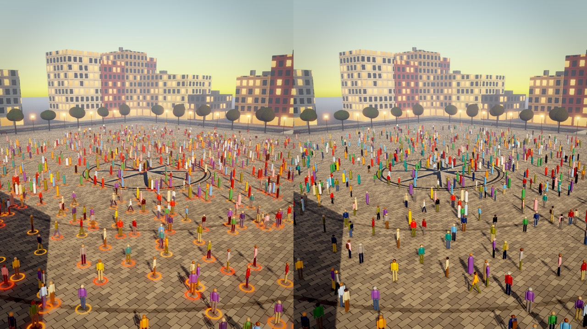
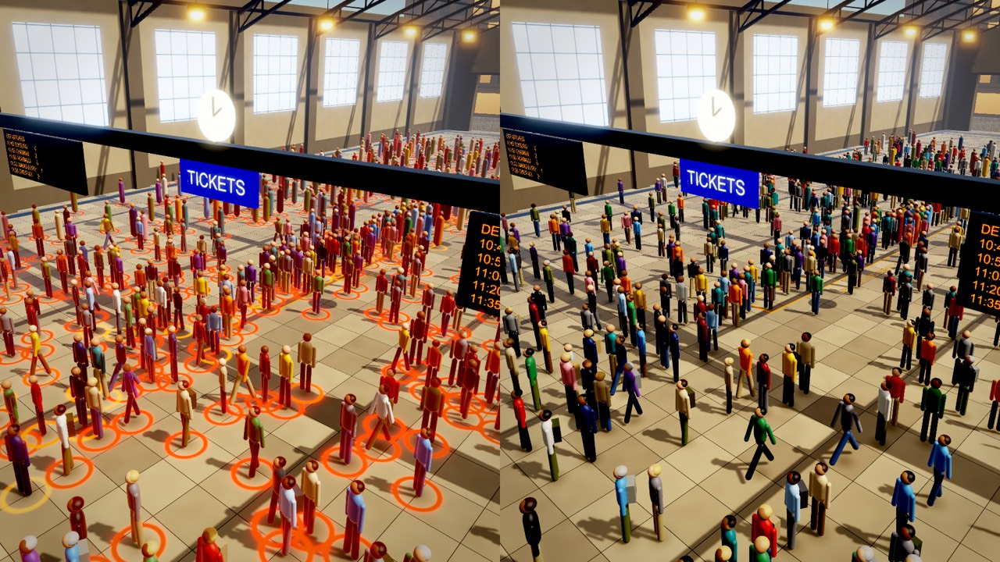
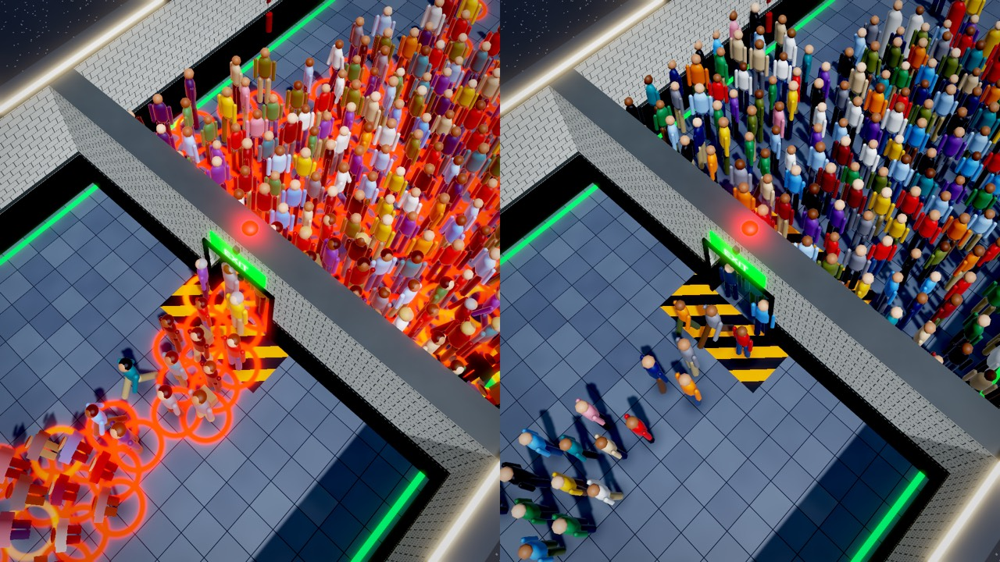
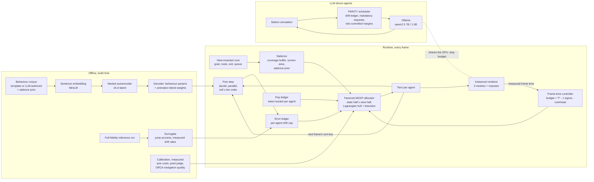
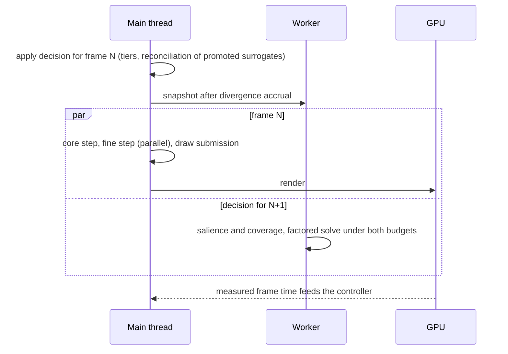

# PARITY

**Dual-budget cross-layer fidelity allocation for real-time crowds with bounded behavioural error.**
RVCE: Computer Graphics & VR (CS373IA) and Parallel Architecture & GPU Programming (CS372IA).

A crowd of thousands cannot all run full behaviour, full navigation, full animation and full meshes
every frame. Engines ration fidelity with distance bands and per-level caps (UE5 MassLOD). PARITY
instead solves, every frame, a multiple-choice knapsack over four axes per agent (behaviour,
navigation, animation, geometry) under two budgets at once:

- a **global** budget: the measured frame time;
- a **per-agent** budget: an error ledger that caps how far each agent's behaviour may drift from a
  full-fidelity reference, forcing periodic restoration so the drift can never grow without bound.

## Scenes

In each image the left half is the MassLOD-style baseline and the right half is PARITY. Both use the
same seed, the same camera and the same renderer, so the only difference is the fidelity policy.
Orange rings mark agents whose behaviour has drifted from the full-fidelity reference. The baseline
accumulates them without limit; PARITY's ledger keeps every agent under its cap.

**Open plaza**


**Transit hub with a ticket queue**


**Evacuation corridor with a bottleneck**


## Architecture



The tier menus per axis:

| Axis | Tier 0 | Tier 1 | Tier 2 | Tier 3 |
|---|---|---|---|---|
| Behaviour | latent, 16 dims | latent, 8 dims | latent, 4 dims | surrogate (rides the core) |
| Navigation | ORCA, 10 neighbours | ORCA, 4 neighbours | separation | none |
| Animation | 12-joint gait | 8 joints | 3 joints | frozen pose |
| Geometry | full mesh | reduced mesh | minimal mesh | impostor |

Decisions are pipelined one frame ahead on a worker thread, so the solve never blocks the frame:



## Results

The full log, with every caveat, is in [STATE.md](STATE.md).

| Question | Result |
|---|---|
| Is drift bounded? (H2) | PARITY's worst agent stays at or under its cap in every cell. The baselines reach 3.3 to 6.05 times it. |
| LLM-driven agents, same model budget | PARITY's steady-state drift is 2 to 4.8 times lower than view-first or round-robin scheduling. Its worst agent reaches 0.94 to 0.98 of the cap; theirs reach 1.2 to 2.4 times it. |
| LLM and rendering on one GPU, measured live | At an identical GPU cost, PARITY keeps every agent within its cap (0.96x) and halves drift. Round-robin reaches 1.76x the cap, and still exceeds it with the GPU saturated. |
| Rendering, 8000 agents (M4, RTX 3050) | PARITY's allocator matches the full-simulation render knapsack on a pixel-level image judge. With the pop ledger it keeps 94 to 99% of that image with 5 to 7 times fewer visible pops. |
| Correctness | The C# engine port agrees with the Python oracle on every allocator decision, and ORCA agrees exactly. |
| Negative results, kept | Separate CPU and GPU budgets bring no gain on CPU-bound frames. Treating shadows as a global option never pays by the pixel judge. A 1.5B model as a middle tier adds nothing, because the distilled surrogate is closer to 7B at 90 of 94 visited contexts. |

## Five invariants

1. Tier costs are measured from telemetry at the operating conditions, never authored.
2. Behaviour parameters and animation blend weights decode from one learned latent, so their errors share a unit.
3. Every agent carries an accumulated-divergence value, and no configuration may exceed its cap.
4. A view-invariant state core is simulated at fixed cost and never allocated.
5. The allocator's own tier output orders the next frame's work.

## Repository

```
sim/        Python simulator, scenes, surrogate, reconciliation, ORCA reference
alloc/      allocators: serial, factored, hull, ledgers; cuda/ and openacc/ modules
latent/     corpus (template and LLM-authored), embedding, autoencoder, truncation
llm/        LLM-driven agents: station, policy tables, scheduler, live server
order/      composite-key ordering study (CS372IA)
bench/      benchmarks; logs/ is not tracked
figures/    plotting scripts
tests/      oracle agreement and unit tests
tools/      Unity sync and build, oracle case generation
unity/      Parity3D (Runtime, Sim, Demo, Bench, Editor, Shaders) and OracleCheck (dotnet)
```

## Running it

The Python side needs Python 3 with numpy, scipy, numba and matplotlib; `latent/` also needs torch
and sentence-transformers.

```bash
pytest -q tests/                                  # unit tests and oracle agreement
python -m sim.run --scene plaza --agents 200 --condition baseline
python -m tools.gen_oracle_cases                  # C# port against the Python oracle (needs dotnet)
bash tools/sync_unity.sh --smoke                  # compile the Unity project headlessly, run the smoke test
bash tools/build_bench.sh win64                   # standalone frame bench zip for another machine
python -m bench.llm_agents                        # LLM-driven agents (needs Ollama with qwen2.5:7b)
python -m bench.gpu_share --live                  # LLM inference and crowd rendering on one GPU
```

The repository holds the Unity project's `Assets/` only. `tools/sync_unity.sh` copies them into a
Unity 6 project (built-in render pipeline; set `PARITY_UNITY_PROJECT`). Open that project and press
Play for the live side-by-side demo, which starts itself in any scene.

The standalone bench runs on Windows without Unity: unzip it and run `run_bench.bat quick`, then
`run_bench.bat`. Results land in `Results/`.
